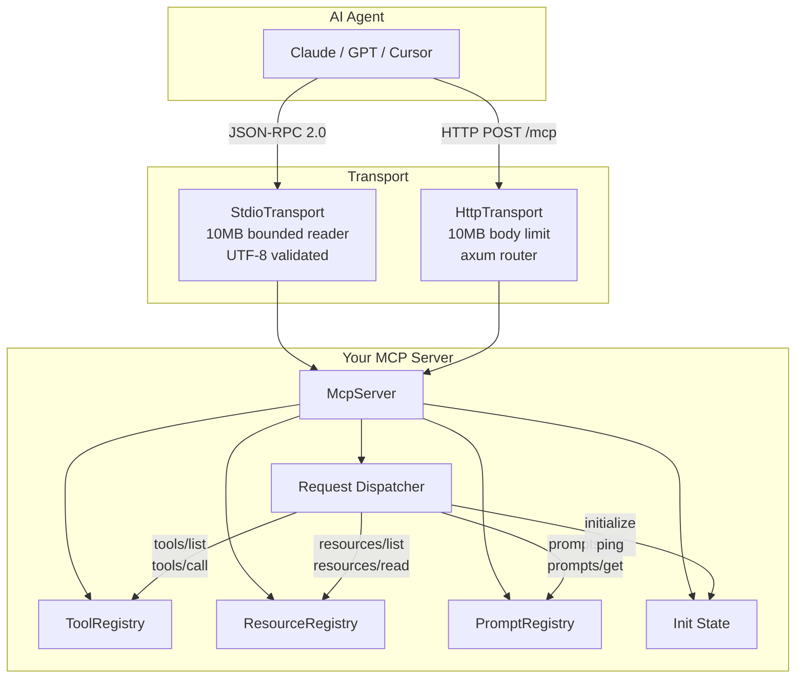
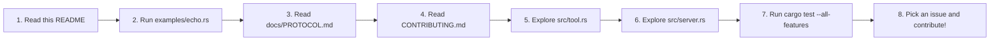
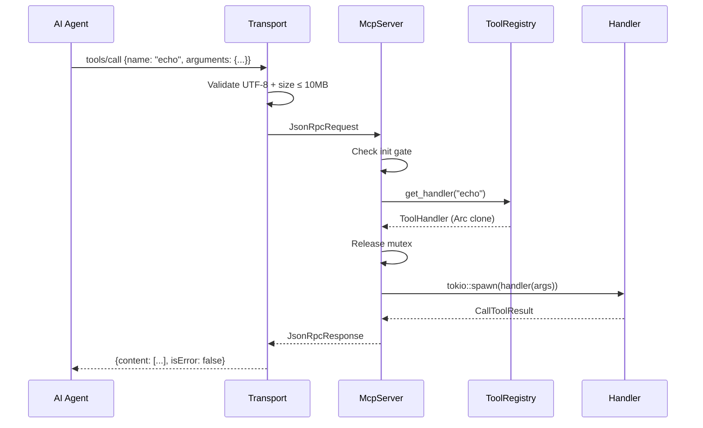

# rust-mcp-sdk

> Rust implementation of the Model Context Protocol (MCP) — build MCP servers with type safety, async performance, and a single static binary.

[](LICENSE)
[](https://www.rust-lang.org)
[](https://modelcontextprotocol.io)
[](#testing)
[](docs/SECURITY.md)

## What is MCP?

The [Model Context Protocol](https://modelcontextprotocol.io/) is an open standard that lets AI agents (Claude, GPT, etc.) communicate with external tools and services via JSON-RPC 2.0. Agents can call tools, read resources, and execute prompts — all through a single protocol.

## Why Rust?

| Metric | TypeScript SDK | Rust SDK |
|--------|---------------|----------|
| Binary size | ~50MB (node + deps) | **~3MB** (static) |
| Startup time | ~500ms | **~2ms** |
| Memory usage | ~50-100MB | **~3-5MB** |
| Distribution | `npm install` + Node.js | **Single binary download** |
| Type safety | Runtime (Zod) | **Compile-time (serde)** |

## Architecture



## Quick Start

### 1. Add to your project

```toml
[dependencies]
mcp-sdk = { version = "0.2", features = ["stdio"] }
```

### 2. Build a server

```rust
use mcp_sdk::{McpServer, StdioTransport, ToolBuilder};
use serde_json::json;
use std::sync::Arc;

#[tokio::main]
async fn main() {
    let server = Arc::new(McpServer::new("my-server", "0.1.0"));

    server.register_tool(
        ToolBuilder::new("greet")
            .description("Greet someone by name")
            .schema(json!({
                "type": "object",
                "properties": {
                    "name": { "type": "string" }
                },
                "required": ["name"]
            }))
            .handler(|args| async move {
                let name = args.get("name")
                    .and_then(|v| v.as_str())
                    .unwrap_or("world");
                Ok(mcp_sdk::CallToolResult::text(format!("Hello, {name}!")))
            })
    ).await;

    StdioTransport::serve(server).await.unwrap();
}
```

### 3. Connect to Claude Code

Add to `~/.claude/claude_desktop_config.json`:

```json
{
  "mcpServers": {
    "my-server": {
      "command": "/path/to/your/binary"
    }
  }
}
```

### 4. Try the examples

```bash
cargo run --example echo    # Tools only (echo + add)
cargo run --example demo    # Tools + resources + prompts
```

## Onboarding

New to the codebase? Here's the path:



| Step | File | Time |
|------|------|------|
| Understand the protocol | [docs/PROTOCOL.md](docs/PROTOCOL.md) | 10 min |
| See a working server | [examples/demo.rs](examples/demo.rs) | 5 min |
| Learn the tool pattern | [src/tool.rs](src/tool.rs) | 5 min |
| Understand request dispatch | [src/server.rs](src/server.rs) | 10 min |
| Security model | [docs/SECURITY.md](docs/SECURITY.md) | 10 min |
| Contribution guide | [CONTRIBUTING.md](CONTRIBUTING.md) | 5 min |

## Feature Flags

| Feature | Default | Description |
|---------|---------|-------------|
| `stdio` | ✅ | stdin/stdout transport for CLI agents (Claude Code, Cursor) |
| `http` | ❌ | HTTP transport for web agents (Windsurf, custom integrations) |

```toml
mcp-sdk = { version = "0.2", features = ["stdio", "http"] }
```

## API Reference

### McpServer

```rust
let server = McpServer::new("name", "version");
```

| Method | Signature | Description |
|--------|-----------|-------------|
| `new()` | `(name, version) -> Self` | Constructor |
| `protocol_version()` | `(ProtocolVersion) -> Self` | Set protocol version (builder) |
| `register_tool()` | `(&ToolBuilder) -> async` | Register a tool |
| `register_resource()` | `(&ResourceBuilder) -> async` | Register a resource |
| `register_prompt()` | `(&PromptBuilder) -> async` | Register a prompt |
| `handle_request()` | `(&JsonRpcRequest) -> async -> McpResult<JsonRpcResponse>` | Process a JSON-RPC request |
| `handle_notification()` | `(&JsonRpcNotification) -> async` | Process a notification |
| `is_initialized()` | `-> async -> bool` | Check init state |
| `server_info()` | `-> &ServerInfo` | Get server name/version |

### Tools

```rust
ToolBuilder::new("tool-name")
    .description("What this tool does")
    .schema(json!({ "type": "object", "properties": { ... } }))
    .handler(|args: Value| async move {
        Ok(CallToolResult::text("result"))
    })
```

### Resources

```rust
server.register_resource(
    ResourceBuilder::new("file:///config.json", "Config")
        .description("Server configuration")
        .mime_type("application/json")
        .handler(|uri| async move {
            Ok(vec![ResourceContents::Text {
                uri: uri.to_string(),
                mime_type: Some("application/json".into()),
                text: r#"{"version": "1.0"}"#.into(),
            }])
        })
).await;
```

### Prompts

```rust
server.register_prompt(
    PromptBuilder::new("code_review")
        .description("Review code")
        .argument("language")
        .argument_with("max_length", |a| a.description("Max words").required())
        .handler(|args| async move {
            let lang = args.get("language")
                .and_then(|v| v.as_str())
                .unwrap_or("rust");
            Ok(mcp_sdk::GetPromptResult {
                description: Some("Code review".into()),
                messages: vec![PromptMessage {
                    role: "user".into(),
                    content: mcp_sdk::Content::text(format!("Review this {lang} code")),
                }],
            })
        })
).await;
```

### Content Types

```rust
Content::text("output string")
Content::Image { data: base64_string, mime_type: "image/png".into() }
Content::ResourceLink { resource: ResourceLink { uri: "file:///x".into(), mime_type: None } }
```

### Transports

```rust
StdioTransport::serve(Arc::new(server)).await?;
HttpTransport::serve(Arc::new(server), "127.0.0.1:3000").await?;
```

## Request Flow



## MCP Protocol Compliance

| Method | Status | Description |
|--------|--------|-------------|
| `initialize` | ✅ | Server handshake + capabilities exchange |
| `notifications/initialized` | ✅ | Client init notification + state tracking |
| `tools/list` | ✅ | List all registered tools |
| `tools/call` | ✅ | Execute a tool by name |
| `ping` | ✅ | Health check |
| `resources/list` | ✅ | List available resources |
| `resources/read` | ✅ | Read a resource by URI |
| `prompts/list` | ✅ | List available prompts |
| `prompts/get` | ✅ | Execute a prompt by name |
| `completion/complete` | 📌 Planned | Autocomplete for arguments |
| `logging/setLevel` | 📌 Planned | Server log level control |

**Protocol version:** `2024-11-05`

## Test Coverage

| Test Suite | Tests | What It Covers |
|-----------|-------|----------------|
| `protocol_test.rs` | 74 | Every type: serialize, deserialize, edge cases |
| `server_test.rs` | 40 | All 9 handlers, init gate, error paths, concurrency |
| `security_test.rs` | 47 | Injection, DoS, panic recovery, concurrency safety |
| `pentest_test.rs` | 33 | Exploit PoCs (pre-handshake, SSRF, path traversal, prompt injection) |
| `tool_test.rs` | 20 | Registry CRUD, builder patterns, panic recovery |
| `resource_test.rs` | 26 | Registry CRUD, blob/text content, overwrite, serde |
| `prompt_test.rs` | 28 | Registry CRUD, argument builder, injection, serde |
| `error_test.rs` | 16 | All 8 variants, code mapping, From conversions |
| `http_transport_test.rs` | 8 | Real HTTP: initialize, tools, errors, concurrent |
| **stdio unit tests** | 8 | Bounded reader: oversized, EOF, multibyte UTF-8 |
| **Total** | **300** | |

```bash
cargo test --all-features          # Run all 300 tests
cargo clippy --all-features -- -D warnings   # Lint (must be clean)
cargo fmt --all -- --check         # Format check
cargo audit                        # Dependency CVE check
```

## Error Handling

```rust
use mcp_sdk::{McpError, McpResult};

handler(|args| async move {
    let name = args.get("name")
        .and_then(|v| v.as_str())
        .ok_or(McpError::InvalidParams("missing 'name' field".into()))?;
    Ok(CallToolResult::text(format!("Hello, {name}")))
})
```

| Error | Code | When |
|-------|------|------|
| `Parse` | -32700 | Invalid JSON |
| `MethodNotFound` | -32601 | Unknown method |
| `InvalidParams` | -32602 | Bad parameters or pre-init request |
| `Internal` | -32603 | Server error, handler panic |
| `ToolNotFound` | -32601 | Unknown tool name |
| `ResourceNotFound` | -32002 | Unknown resource URI |
| `PromptNotFound` | -32002 | Unknown prompt name |
| `Transport` | -32000 | I/O error |

## Security

### Built-in Protections

| Protection | Status |
|-----------|--------|
| Initialization gate (pre-handshake access blocked) | ✅ |
| Bounded stdio reader (10MB max, rejects before allocation) | ✅ |
| HTTP body size limit (10MB) | ✅ |
| Handler panic isolation (tokio::spawn + JoinError catch) | ✅ |
| Panic messages sanitized (no secrets leaked) | ✅ |
| Mutex released before handler (no contention DoS) | ✅ |
| Tool arguments at DEBUG level (not INFO) | ✅ |
| Raw payload removed from parse error logs | ✅ |
| No dependency CVEs (cargo audit clean) | ✅ |

Full security model: [docs/SECURITY.md](docs/SECURITY.md)

### Developer Responsibilities

1. **Validate tool arguments** inside handlers — the SDK doesn't enforce `inputSchema`
2. **Validate resource URIs** against path traversal
3. **Never pass arguments to shell commands** without sanitization
4. **Add auth for HTTP** — use a reverse proxy
5. **Bind HTTP to `127.0.0.1`** unless you have auth
6. **Use `Result<T, McpError>` in handlers** — never `panic!()`

## Project Structure

```
rust-mcp-sdk/
├── src/
│   ├── lib.rs              Public API re-exports
│   ├── protocol.rs         JSON-RPC 2.0 + MCP protocol types (332 lines)
│   ├── server.rs           McpServer: dispatch, init gate, handlers (191 lines)
│   ├── tool.rs             ToolBuilder + ToolRegistry with panic recovery
│   ├── resource.rs         ResourceBuilder + ResourceRegistry
│   ├── prompt.rs           PromptBuilder + PromptRegistry
│   ├── error.rs            McpError enum with JSON-RPC code mapping
│   └── transport/
│       ├── mod.rs          Feature-gated transport exports
│       ├── stdio.rs        Bounded line reader + newline-delimited JSON
│       └── http.rs         axum POST /mcp with 10MB body limit
├── tests/                  300 tests across 10 files
├── examples/
│   ├── echo.rs             Minimal server (2 tools)
│   └── demo.rs             Full server (2 tools + 2 resources + 2 prompts)
├── docs/
│   ├── PROTOCOL.md         Protocol lifecycle, all methods, Mermaid diagrams
│   └── SECURITY.md         Threat model, attack surface, mitigations
├── .github/workflows/
│   └── ci.yml              CI: test + clippy + fmt on push/PR (Rust 1.75 + stable)
├── Cargo.toml              Package manifest (features: stdio, http)
├── CHANGELOG.md            Version history
└── CONTRIBUTING.md         Build/test/lint instructions + commit format
```

## Use Cases

- **Tool servers** — Expose CLI tools, database queries, or API calls to AI agents
- **Sandbox execution** — Like [agentic-armor](https://github.com/calebrosario/agentic-armor) — manage Docker containers for untrusted code
- **Data access** — Give agents read-only access to databases, files, or APIs
- **Custom integrations** — Bridge any system to any MCP-compatible AI agent

## Comparison with TypeScript SDK

| Feature | TypeScript (`@modelcontextprotocol/sdk`) | Rust (`mcp-sdk`) |
|---------|------------------------------------------|-------------------|
| Binary | Node.js + npm deps | Single static binary |
| Schema validation | Zod (runtime) | serde + JSON Schema (compile-time) |
| Transport | stdio + HTTP | stdio + HTTP (feature-gated) |
| Async model | Event loop (single-threaded) | Tokio (multi-threaded) |
| Error handling | try/catch + custom errors | `Result<T, McpError>` |
| Tool registration | `server.registerTool()` | `server.register_tool(ToolBuilder)` |
| Panic recovery | try/catch | `tokio::spawn` + `JoinError` catch |
| Init gate | Client-side | Server-enforced |
| Payload limit | Configurable | 10MB (stdio + HTTP) |
| Startup | ~500ms | ~2ms |
| Memory | ~50-100MB | ~3-5MB |

## License

MIT — see [LICENSE](LICENSE).
