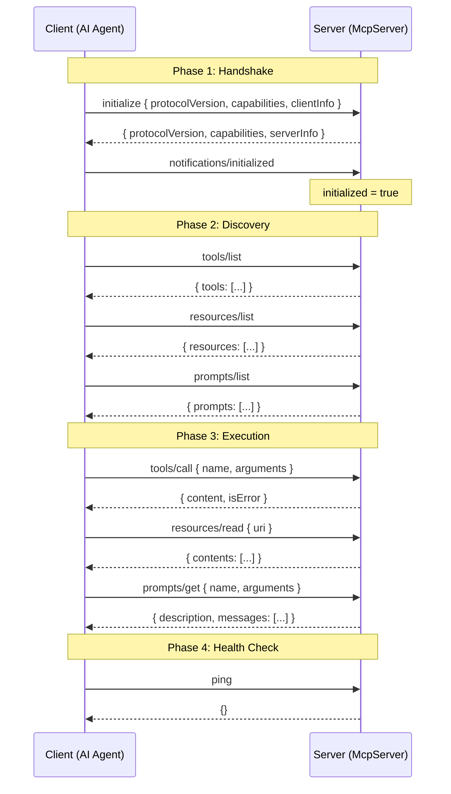
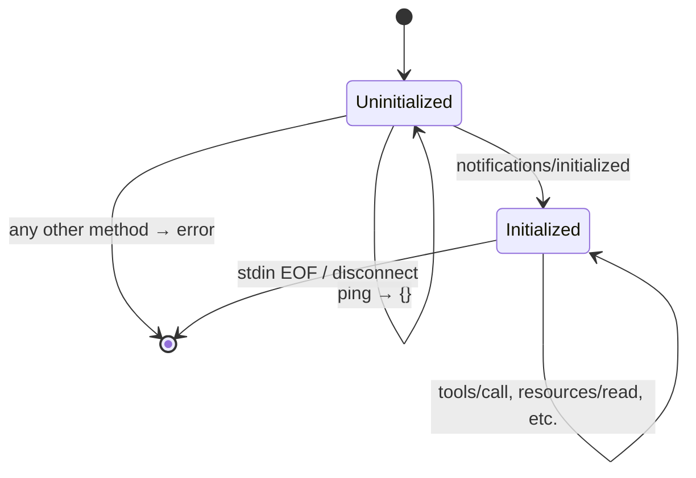
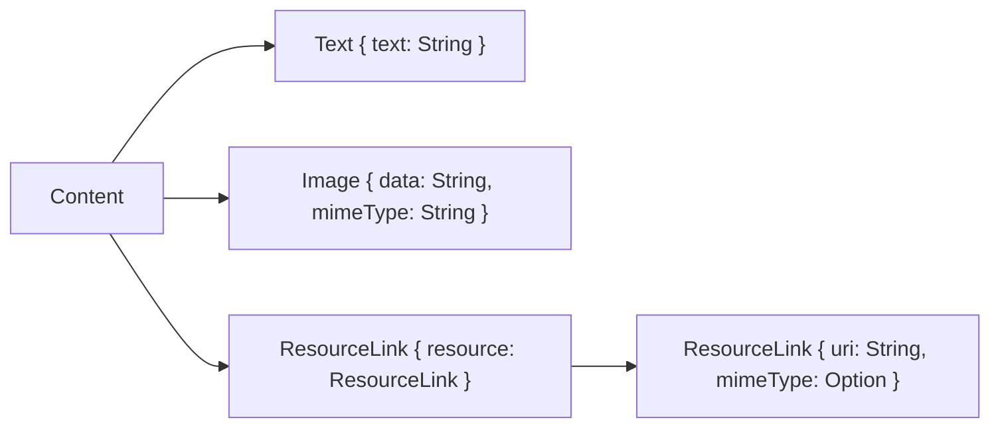
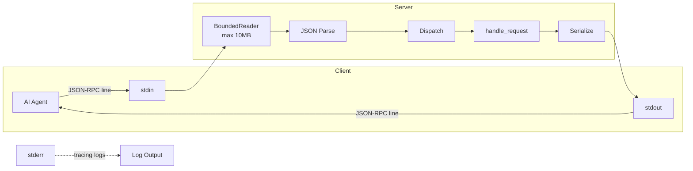
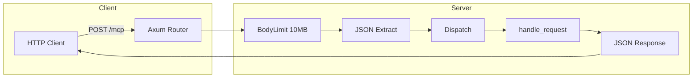
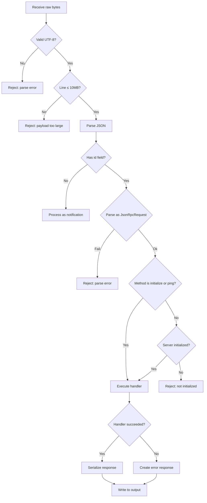

# MCP Protocol Implementation

This document describes how `rust-mcp-sdk` implements the [Model Context Protocol](https://modelcontextprotocol.io/) specification version `2024-11-05`.

## Protocol Version

Currently implements `2024-11-05`. Configure via:

```rust
McpServer::new("server", "1.0.0")
    .protocol_version(ProtocolVersion::V20241105)
```

## Message Format

All communication uses [JSON-RPC 2.0](https://www.jsonrpc.org/specification) over newline-delimited JSON (stdio) or HTTP POST.

### Request

```json
{
  "jsonrpc": "2.0",
  "id": 1,
  "method": "tools/call",
  "params": { "name": "echo", "arguments": { "message": "hello" } }
}
```

- `id` — `Number(i64)` or `String`. Used to match responses to requests.
- `method` — The JSON-RPC method name (e.g., `"tools/call"`).
- `params` — Optional method-specific parameters.

### Response (success)

```json
{
  "jsonrpc": "2.0",
  "id": 1,
  "result": {
    "content": [{ "type": "text", "text": "hello" }],
    "isError": false
  }
}
```

### Response (error)

```json
{
  "jsonrpc": "2.0",
  "id": 1,
  "error": { "code": -32601, "message": "Tool not found: unknown" }
}
```

### Notification (no response)

```json
{ "jsonrpc": "2.0", "method": "notifications/initialized" }
```

Notifications have no `id` field and receive no response.

## Connection Lifecycle



### Initialization Gate

The server enforces an initialization gate. All methods except `initialize` and `ping` are rejected with `InvalidParams` until the client has completed the handshake:



## Methods

### initialize

Exchange protocol version, capabilities, and server identity.

**Request params:**
```json
{
  "protocolVersion": "2024-11-05",
  "capabilities": { "experimental": {} },
  "clientInfo": { "name": "claude-code", "version": "1.0" }
}
```

**Response:**
```json
{
  "protocolVersion": "2024-11-05",
  "capabilities": {
    "tools": { "listChanged": false },
    "resources": { "subscribe": false, "listChanged": false },
    "prompts": { "listChanged": false }
  },
  "serverInfo": { "name": "my-server", "version": "0.2.0" }
}
```

> **Note:** Client `params` are logged at INFO level for debugging. The server advertises all capabilities unconditionally.

### notifications/initialized

Client notification indicating the handshake is complete. Sets the server's `initialized` flag to `true`, enabling all subsequent methods.

No params. No response.

### tools/list

List all registered tools with their schemas.

No params.

**Response:**
```json
{
  "tools": [
    {
      "name": "echo",
      "description": "Echo back the provided message",
      "inputSchema": {
        "type": "object",
        "properties": { "message": { "type": "string" } },
        "required": ["message"]
      }
    }
  ],
  "nextCursor": null
}
```

### tools/call

Execute a tool by name with the provided arguments.

**Params:**
```json
{ "name": "echo", "arguments": { "message": "hello" } }
```

**Response:**
```json
{
  "content": [{ "type": "text", "text": "hello" }],
  "isError": false
}
```

**Error response (tool not found):**
```json
{
  "error": { "code": -32601, "message": "Tool not found: nonexistent" }
}
```

> **Security:** Tool arguments are logged at DEBUG level (not INFO). Handler panics are caught and return `"Handler execution failed"` without leaking panic messages.

### resources/list

List all registered resources.

No params.

**Response:**
```json
{
  "resources": [
    {
      "uri": "file:///config.json",
      "name": "Config",
      "description": "Server configuration",
      "mimeType": "application/json"
    }
  ],
  "nextCursor": null
}
```

### resources/read

Read a resource by URI. Returns text or blob content.

**Params:**
```json
{ "uri": "file:///config.json" }
```

**Response (text):**
```json
{
  "contents": [
    {
      "type": "text",
      "uri": "file:///config.json",
      "mimeType": "application/json",
      "text": "{\"version\": \"1.0\"}"
    }
  ]
}
```

**Response (blob):**
```json
{
  "contents": [
    {
      "type": "blob",
      "uri": "file:///image.png",
      "mimeType": "image/png",
      "blob": "iVBORw0KGgo="
    }
  ]
}
```

### prompts/list

List all registered prompts with their argument schemas.

No params.

**Response:**
```json
{
  "prompts": [
    {
      "name": "code_review",
      "description": "Review code",
      "arguments": [
        {
          "name": "language",
          "description": "Programming language",
          "required": true
        }
      ]
    }
  ],
  "nextCursor": null
}
```

### prompts/get

Resolve a prompt by name with the provided arguments.

**Params:**
```json
{ "name": "code_review", "arguments": { "language": "rust" } }
```

**Response:**
```json
{
  "description": "Code review prompt",
  "messages": [
    {
      "role": "user",
      "content": { "type": "text", "text": "Review this rust code" }
    }
  ]
}
```

### ping

Health check. Returns empty object.

No params.

**Response:** `{}`

## Content Types

The `Content` enum supports three types:



## Error Codes

| Code | Meaning | Rust Variant | Triggered By |
|------|---------|-------------|-------------|
| `-32700` | Parse error | `McpError::Parse` | Invalid JSON in stdin/HTTP body |
| `-32601` | Method not found | `McpError::MethodNotFound` | Unknown JSON-RPC method |
| `-32602` | Invalid params | `McpError::InvalidParams` | Missing/invalid params, or pre-init request |
| `-32603` | Internal error | `McpError::Internal` | Handler failure, panic, serialization error |
| `-32601` | Tool not found | `McpError::ToolNotFound` | Unknown tool name in `tools/call` |
| `-32002` | Resource not found | `McpError::ResourceNotFound` | Unknown URI in `resources/read` |
| `-32002` | Prompt not found | `McpError::PromptNotFound` | Unknown name in `prompts/get` |
| `-32000` | Transport error | `McpError::Transport` | I/O error (stdin/stdout/HTTP) |

## Transports

### stdio (default)



- Client writes JSON-RPC messages to server's stdin, one per line (newline-delimited)
- Server writes responses to stdout, one per line
- stderr is used for logging (`tracing`)
- EOF on stdin signals client disconnect
- **Max line size: 10MB** — oversized lines are rejected before memory allocation
- **UTF-8 validated** — invalid UTF-8 rejected with parse error

### HTTP (feature-gated)



- `POST /mcp` with JSON-RPC body
- Response is JSON-RPC response (HTTP 200 for both success and error)
- Notifications return `{ "status": "ok" }`
- Invalid JSON returns HTTP 400
- **Body size limit: 10MB** (`DefaultBodyLimit`)
- **No built-in authentication** — use reverse proxy

Enable with:
```toml
mcp-sdk = { version = "0.2", features = ["stdio", "http"] }
```

## Request Processing Flow


