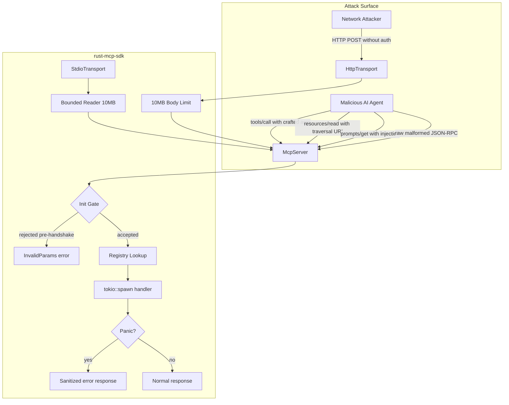

# Security Model

This document describes the security architecture, threat model, and known limitations of `rust-mcp-sdk`.

## Threat Model

MCP servers expose tools, resources, and prompts to AI agents. The primary threat actors are:

1. **Malicious AI agents** — A compromised or adversarial agent that sends crafted requests to exploit the server
2. **Network attackers** — An attacker who can reach the HTTP transport endpoint
3. **Compromised handlers** — A handler that has been poisoned (via supply chain or dynamic registration) to exfiltrate data or inject instructions



## Built-in Protections

| Protection | Implementation | Effect |
|-----------|---------------|--------|
| **Initialization gate** | `handle_request()` checks `initialized` flag | Blocks all methods except `initialize`/`ping` before handshake |
| **Bounded stdio reader** | `fill_buf()`/`consume()` loop with 10MB cap | Rejects oversized lines before memory allocation |
| **HTTP body limit** | `axum::extract::DefaultBodyLimit::max(10MB)` | Rejects oversized HTTP payloads |
| **Handler panic isolation** | `tokio::spawn` + `JoinError` catch in all 3 registries | Panicking handlers return `"Handler execution failed"` instead of crashing |
| **Mutex released before handler** | Clone handler Arc, drop lock, then spawn | Prevents mutex contention DoS |
| **Panic message sanitization** | Server returns generic message | JoinError text (may contain secrets) not leaked to client |
| **Argument logging at DEBUG** | `tracing::debug!` not `tracing::info!` | Sensitive tool args not in production logs |
| **Raw payload removed from logs** | Parse error logs exclude raw input | Prevents log injection |
| **UTF-8 validation** | `std::str::from_utf8()` before parsing | Rejects binary/broken-UTF-8 input |

## Known Limitations

These are inherent to the SDK's design and cannot be fixed without restricting the API. They are the responsibility of server implementers.

### No Input Schema Validation at Runtime

Tool `inputSchema` is stored and returned via `tools/list`, but the SDK does **not** validate incoming `arguments` against it. Arguments are passed as raw `serde_json::Value`.

**Risk:** Handler receives unexpected input types if it trusts the schema.

**Mitigation:** Validate arguments inside your handler:
```rust
.handler(|args| async move {
    let name = args.get("name")
        .and_then(|v| v.as_str())
        .ok_or_else(|| McpError::InvalidParams("missing 'name'".into()))?;
    // ...
})
```

### No Resource URI Validation

Resource URIs are passed directly to handlers without path traversal checks.

**Risk:** If a handler opens files based on the URI, `../../etc/passwd` could read arbitrary files.

**Mitigation:** Validate URIs in your handler:
```rust
.handler(|uri| async move {
    if uri.contains("..") {
        return Err(McpError::InvalidParams("path traversal detected".into()));
    }
    // ...
})
```

### No HTTP Authentication

The HTTP transport has no built-in authentication, authorization, or session management.

**Risk:** Anyone who can reach the port can call any tool, read any resource, or execute any prompt.

**Mitigation:** Put the HTTP transport behind a reverse proxy with authentication:
```
nginx → auth check → 127.0.0.1:3000/mcp
```

### No Rate Limiting

Neither transport implements rate limiting or concurrency limits.

**Risk:** A fast client can exhaust memory via many concurrent `tokio::spawn` calls.

**Mitigation:** Use `tokio::sync::Semaphore` to limit concurrent handlers, or add rate limiting at the reverse proxy level.

### Error Messages Enable Enumeration

Different error codes for `ToolNotFound` (-32601) vs `ResourceNotFound` (-32002) vs `PromptNotFound` (-32002) allow attackers to determine which resource types exist.

**Risk:** Attacker can enumerate the server's tool/resource/prompt surface.

**Mitigation:** This is inherent to the MCP protocol's error model. Accept this or return a generic error for all not-found cases.

### Tool/Resource/Prompt Descriptions Exposed

`tools/list`, `resources/list`, and `prompts/list` return ALL registered items with full descriptions and schemas. There is no access control on listing.

**Risk:** Attacker discovers the complete attack surface in one request.

**Mitigation:** Only register tools that should be accessible to all connected clients. For multi-tenant scenarios, use separate server instances.

## Penetration Test Results

The SDK was penetration-tested with 33 exploit PoC tests (`tests/pentest_test.rs`) and 47 defensive security tests (`tests/security_test.rs`).

### Vulnerabilities Found and Fixed

| Vulnerability | Severity | Status |
|--------------|----------|--------|
| Pre-handshake tool/resource/prompt access | Critical | ✅ Fixed (init gate) |
| Unbounded stdin payload (OOM) | Critical | ✅ Fixed (bounded reader) |
| HTTP no body size limit (OOM) | Critical | ✅ Fixed (DefaultBodyLimit) |
| Mutex held during handler (DoS) | High | ✅ Fixed (lock released before spawn) |
| Handler panic crashes server | High | ✅ Fixed (tokio::spawn + JoinError catch) |
| Panic message leaks secrets | High | ✅ Fixed (sanitized error response) |
| Tool arguments logged at INFO | High | ✅ Fixed (moved to DEBUG) |
| Raw payload in parse error logs | Medium | ✅ Fixed (removed) |

### Vulnerabilities Documented (SDK-level)

| Vulnerability | Severity | Status |
|--------------|----------|--------|
| No input schema validation | Medium | Documented (handler responsibility) |
| No URI path traversal protection | Medium | Documented (handler responsibility) |
| No HTTP authentication | Critical | Documented (reverse proxy required) |
| No rate limiting | High | Documented (reverse proxy / Semaphore) |
| Error oracle (tool/resource existence) | Medium | Accepted (protocol inherent) |
| Full schema disclosure via list methods | Medium | Accepted (protocol inherent) |
| Server fingerprinting via initialize | Low | Accepted (protocol inherent) |
| No jsonrpc version validation | Low | Accepted (low impact) |
| Duplicate JSON keys (last wins) | Low | Accepted (serde behavior) |

### Dependency Security

```bash
cargo audit  # 0 CVEs across 179 dependencies
```

Run `cargo audit` regularly to check for new vulnerabilities in dependencies.

## Security Checklist for Server Implementers

Before deploying an MCP server built with this SDK:

- [ ] **Validate all tool arguments** inside handlers — don't trust `inputSchema`
- [ ] **Validate resource URIs** against path traversal
- [ ] **Never pass tool arguments to shell commands** without sanitization
- [ ] **Use `Result<T, McpError>` in handlers** — never `panic!()`
- [ ] **Bind HTTP transport to `127.0.0.1`** unless you have auth
- [ ] **Add authentication** via reverse proxy if exposing HTTP
- [ ] **Add rate limiting** via reverse proxy or `tokio::sync::Semaphore`
- [ ] **Run `cargo audit`** before each release
- [ ] **Set `RUST_LOG=info`** in production (not `debug`) to avoid logging sensitive args
- [ ] **Review tool descriptions** for prompt injection content
- [ ] **Review tool response content** — responses enter the LLM context window
